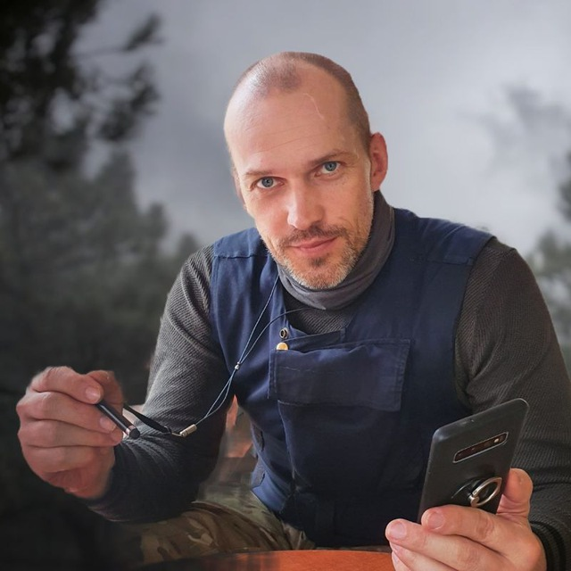

#### Основы Системной Биорегуляции (ОСБ)  
  
[А. И. Талалакин](https://t.me/osbmd)  
***
- [x] [ОСБ. ИНСТРУКЦИИ.](!0SB_Instructio.md) 
- [x] [ОКНО ЗАПРОСА](http://mductor.weebly.com/a.html) (VPN-доступ)    
***
#### Статьи для самостоятельного изучения:
- [x] [ДМСО. Григорович Н. А.](DMSO_NANO.md)   
- [x] [ДМСО. Апротонный растворитель](DMSO_APROTON.md)
***
#### Упражнения:
- [x] [Крылья Ангела](U__Krylia_Angela.md)
